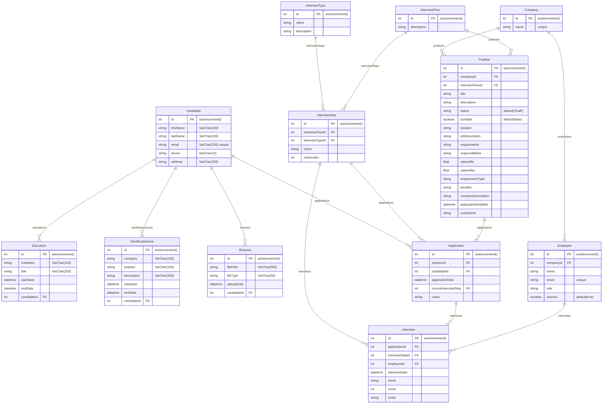

# EN
## **Project Description**

This project is a candidate and interview management system designed to streamline the administration of recruitment processes. The system manages candidate information, their educational and work experience, as well as company job openings and the associated interview processes.

## **Database Model**

### **Entities and Relationships**

### **Candidate**

- **id**: Unique identifier of the candidate (auto-increment).
- **firstName**: Candidate's first name.
- **lastName**: Candidate's last name.
- **email**: Candidate's email (unique).
- **phone**: Candidate's phone number.
- **address**: Candidate's address.

Relationships:

- A candidate can have multiple educational experiences (Education).
- A candidate can have multiple work experiences (WorkExperience).
- A candidate can have multiple résumés (Resume).
- A candidate can have multiple applications to job positions (Application).

### **Education**

- **id**: Identificador único de la educación (autoincremental).
- **institution**: Educational institution.
- **title**: Degree or qualification obtained.
- **startDate**: Start date of the education.
- **endDate**: End date of the education.
- **candidateId**: Candidate identifier (FK).

### **WorkExperience**

- **id**: Unique identifier of the work experience (auto-increment).
- **company**: Company where the candidate worked.
- **position**: Job position held.
- **description**: Description of the work performed.
- **startDate**: Job start date.
- **endDate**: Job end date.
- **candidateId**: Candidate identifier (FK).

## **Resume**

- **id**: Unique identifier of the resume (auto-increment).
- **filePath**: File path of the resume.
- **fileType**: File type of the resume.
- **uploadDate**: Upload date of the resume.
- **candidateId**: Candidate identifier (FK).

### **Company**

- **id**: Unique identifier of the company (auto-increment).
- **name**: Company name (unique).

Relationships:

- A company can have multiple employees (Employee).
- A company can have multiple open positions (Position).

### **Employee**

- **id**: Unique identifier of the employee (auto-increment).
- **companyId**: Company identifier (FK).
- **name**: Employee's name.
- **email**: Employee's email (unique).
- **role**: Employee's role.
- **isActive**: Indicates whether the employee is active (default: true).

### **InterviewType**

- **id**: Unique identifier of the interview type (auto-increment).
- **name**: Interview type name.
- **description**: Description of the interview type.

Relationships:

An interview type can be associated with multiple interview steps (InterviewStep).

### **InterviewFlow**

- **id**: Unique identifier of the interview flow (auto-increment).
- **description**: Description of the interview flow.

Relationships:

- An interview flow can have multiple interview steps (InterviewStep).
- An interview flow can be associated with multiple job positions (Position).

### **InterviewStep**

- **id**: Unique identifier of the interview step (auto-increment).
- **interviewFlowId**: Interview flow identifier (FK).
- **interviewTypeId**: Interview type identifier (FK).
- **name**: Name of the interview step.
- **orderIndex**: Order index of the step in the interview flow.

Relationships:

- An interview step can be associated with multiple applications (Application).
- An interview step can be associated with multiple interviews (Interview).

### **Position**

- **id**: Unique identifier of the position (auto-increment).
- **companyId**: Company identifier (FK).
- **interviewFlowId**: Interview flow identifier (FK).
- **title**: Job position title.
- **description**: Description of the position.
- **status**: Status of the position (default: 'Draft').
- **isVisible**: Indicates whether the position is visible (default: false).
- **location**: Job location.
- **jobDescription**: Job description.
- **requirements**: Job requirements.
- **responsibilities**: Job responsibilities.
- **salaryMin**: Minimum salary.
- **salaryMax**: Maximum salary.
- **employmentType**: Type of employment.
- **benefits**: Job benefits.
- **companyDescription**: Company description.
- **applicationDeadline**: Application deadline date.
- **contactInfo**: Contact information.

Relationships:

- A position can have multiple applications (Application).

###**Application**

- **id**: Unique identifier of the application (auto-increment).
- **positionId**: Position identifier (FK).
- **candidateId**: Candidate identifier (FK).
- **applicationDate**: Application date.
- **currentInterviewStep**: Current interview step identifier (FK).
- **notes**: Additional notes about the application.

Relationships:

- Una aplicación puede tener múltiples entrevistas (Interview).

### **Interview**

- **id**: Unique identifier of the interview (auto-increment).
- **applicationId**: Application identifier (FK).
- **interviewStepId**: Interview step identifier (FK).
- **employeeId**: Employee identifier (FK).
- **interviewDate**: Interview date.
- **result**: Interview result.
- **score**: Interview score.
- **notes**: Additional notes about the interview.

# Diagram ERD

# ES
## **Descripción del Proyecto**

Este proyecto es un sistema de gestión de candidatos y entrevistas que facilita la administración de procesos de selección de personal. El sistema gestiona la información de los candidatos, sus experiencias laborales y académicas, así como las posiciones abiertas en las empresas y los procesos de entrevistas asociados.

## **Modelo de Base de Datos**

### **Entidades y Relaciones**

### **Candidate (Candidato)**

- **id**: Identificador único del candidato (autoincremental).
- **firstName**: Nombre del candidato.
- **lastName**: Apellido del candidato.
- **email**: Correo electrónico del candidato (único).
- **phone**: Teléfono del candidato.
- **address**: Dirección del candidato.

Relaciones:

- Un candidato puede tener múltiples experiencias educativas (Education).
- Un candidato puede tener múltiples experiencias laborales (WorkExperience).
- Un candidato puede tener múltiples currículums (Resume).
- Un candidato puede tener múltiples aplicaciones a posiciones (Application).

### **Education (Educación)**

- **id**: Identificador único de la educación (autoincremental).
- **institution**: Institución educativa.
- **title**: Título obtenido.
- **startDate**: Fecha de inicio de la educación.
- **endDate**: Fecha de finalización de la educación.
- **candidateId**: Identificador del candidato (FK).

### **WorkExperience (Experiencia Laboral)**

- **id**: Identificador único de la experiencia laboral (autoincremental).
- **company**: Empresa donde se trabajó.
- **position**: Cargo ocupado.
- **description**: Descripción del trabajo realizado.
- **startDate**: Fecha de inicio del trabajo.
- **endDate**: Fecha de finalización del trabajo.
- **candidateId**: Identificador del candidato (FK).

### **Resume (Currículum)**

- **id**: Identificador único del currículum (autoincremental).
- **filePath**: Ruta del archivo del currículum.
- **fileType**: Tipo de archivo del currículum.
- **uploadDate**: Fecha de subida del currículum.
- **candidateId**: Identificador del candidato (FK).

### **Company (Empresa)**

- **id**: Identificador único de la empresa (autoincremental).
- **name**: Nombre de la empresa (único).

Relaciones:

- Una empresa puede tener múltiples empleados (Employee).
- Una empresa puede tener múltiples posiciones abiertas (Position).

### **Employee (Empleado)**

- **id**: Identificador único del empleado (autoincremental).
- **companyId**: Identificador de la empresa (FK).
- **name**: Nombre del empleado.
- **email**: Correo electrónico del empleado (único).
- **role**: Rol del empleado.
- **isActive**: Indica si el empleado está activo (por defecto, true).

### **InterviewType (Tipo de Entrevista)**

- **id**: Identificador único del tipo de entrevista (autoincremental).
- **name**: Nombre del tipo de entrevista.
- **description**: Descripción del tipo de entrevista.

Relaciones:

- Un tipo de entrevista puede estar asociado a múltiples pasos de entrevista (InterviewStep).

### **InterviewFlow (Flujo de Entrevista)**

- **id**: Identificador único del flujo de entrevista (autoincremental).
- **description**: Descripción del flujo de entrevista.

Relaciones:

- Un flujo de entrevista puede tener múltiples pasos de entrevista (InterviewStep).
- Un flujo de entrevista puede estar asociado a múltiples posiciones (Position).

### **InterviewStep (Paso de Entrevista)**

- **id**: Identificador único del paso de entrevista (autoincremental).
- **interviewFlowId**: Identificador del flujo de entrevista (FK).
- **interviewTypeId**: Identificador del tipo de entrevista (FK).
- **name**: Nombre del paso de entrevista.
- **orderIndex**: Índice de orden del paso en el flujo de entrevistas.

Relaciones:

- Un paso de entrevista puede estar asociado a múltiples aplicaciones (Application).
- Un paso de entrevista puede estar asociado a múltiples entrevistas (Interview).

### **Position (Posición)**

- **id**: Identificador único de la posición (autoincremental).
- **companyId**: Identificador de la empresa (FK).
- **interviewFlowId**: Identificador del flujo de entrevistas (FK).
- **title**: Título de la posición.
- **description**: Descripción de la posición.
- **status**: Estado de la posición (por defecto, 'Draft').
- **isVisible**: Indica si la posición es visible (por defecto, false).
- **location**: Ubicación de la posición.
- **jobDescription**: Descripción del trabajo.
- **requirements**: Requisitos del trabajo.
- **responsibilities**: Responsabilidades del trabajo.
- **salaryMin**: Salario mínimo.
- **salaryMax**: Salario máximo.
- **employmentType**: Tipo de empleo.
- **benefits**: Beneficios del empleo.
- **companyDescription**: Descripción de la empresa.
- **applicationDeadline**: Fecha límite de la aplicación.
- **contactInfo**: Información de contacto.

Relaciones:

- Una posición puede tener múltiples aplicaciones (Application).

### **Application (Aplicación)**

- **id**: Identificador único de la aplicación (autoincremental).
- **positionId**: Identificador de la posición (FK).
- **candidateId**: Identificador del candidato (FK).
- **applicationDate**: Fecha de la aplicación.
- **currentInterviewStep**: Identificador del paso de entrevista actual (FK).
- **notes**: Notas adicionales de la aplicación.

Relaciones:

- Una aplicación puede tener múltiples entrevistas (Interview).

### **Interview (Entrevista)**

- **id**: Identificador único de la entrevista (autoincremental).
- **applicationId**: Identificador de la aplicación (FK).
- **interviewStepId**: Identificador del paso de entrevista (FK).
- **employeeId**: Identificador del empleado (FK).
- **interviewDate**: Fecha de la entrevista.
- **result**: Resultado de la entrevista.
- **score**: Puntuación de la entrevista.
- **notes**: Notas adicionales de la entrevista.

# Diagram ERD

